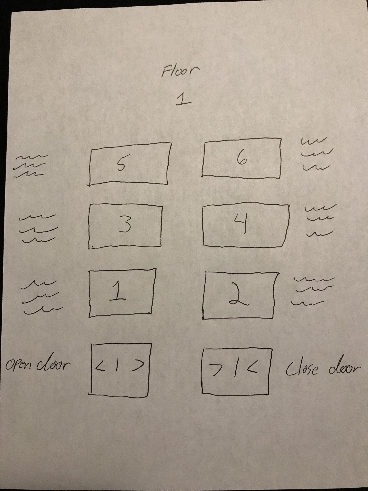

# Homework-1-Human-Computer-Interaction
[Presentation](https://github.com/terran-king/Homework-1-Human-Computer-Interaction/blob/master/README.md)

[Elevator Gif](https://github.com/terran-king/Homework-1-Human-Computer-Interaction/blob/master/TerranHomeworkgif.gif)

[Demo](https://github.com/terran-king/Homework-1-Human-Computer-Interaction/blob/master/terranKingHomework1.pde)

C:
This elevator was found at JCPenny. The elevator layout could be updated to tell the user what is on each floor. As well the button could have an audio cue that the button has been hit so one knows that the button has been hit.

B:
The user walks into the elevator, presses the button that cordinates with the floor they need to go to and the elevator takes tehm to this floor. The elevator usually gives feedback to the user by lighting up the button that the user presses. The elevator supports the user by telling the user which floor the button corisponds to either on the button or next to the button. The elevator also supports people with disabilities that use braile. They would be able to read the buttons with the brail that is on the button.

I went with a simple design that has the numbered buttons with text next to the button that would tell you what is on that floor. As well I have what floor you are currently on at the top of the button layout. The buttons will light up when pressed an stay lit up until the user is on the correct floor. The interface will have voice commands to work for people with disabilities
